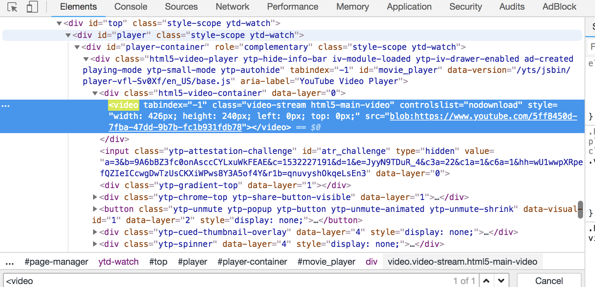
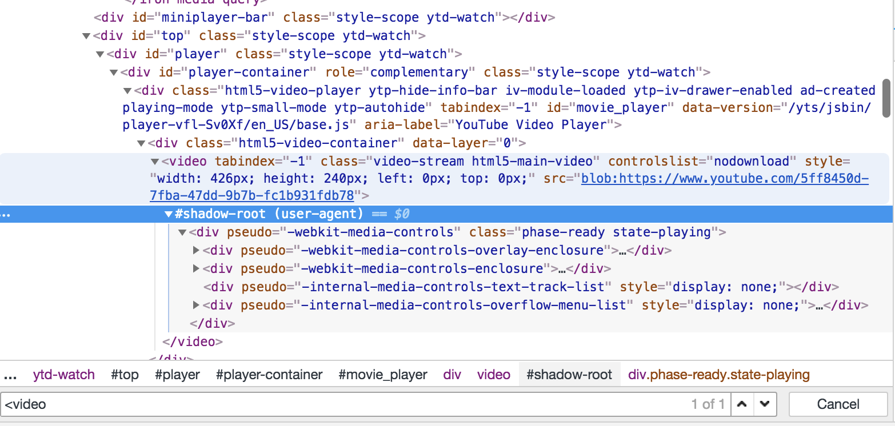

# Angular Component Advanced
- 컴포넌트는 독립된 스코프를 가진 하나의 완결된 뷰를 그리는 요소
- 로직과 CSS가 해당 컴포넌트 안에서만 유효
- 객체 지향 방식으로 컴포넌트를 만들면 적합하다.
- 각각의 객체가 서로 상태를 주고 받으며 메서드를 호출하며 애플리케이션을 구성.

## Component?

### 웹 컴포넌트
- 위에 정의한 컴포넌트 정의와 달리, 브라우저에서는 컴포넌트에 독립적인 환경을 허용하지 않는다.
- 즉, 컴포넌트가 아닌 페이지 단위로 DOM을 읽고 js, css 정보를 페이지 단위로 적용 및 공유한다.
- 그래서 Custom Elements, HTML Imports, Template, Shadow DOM 4개의 기술 스펙으로 이루어진 웹 컴포넌트라는 표준이 생겼다.
- Custom Elements : 브라우저 HTML 표준에 명시되지 않는 요소.
- Template : 화면에 렌더링되지 않지만 동적으로 렌더링할 수 있는 template요소.
- Html Imports : HTML페이지 안에서 다른 HTML을 불러올 수 있다.
- Shadow DOM : DOM트리 내에 독립적 환경의 새로운 DOM 트리를 구축하여 자식 요소를 포함시킬 수 있다.
  - 유튜브에서의 video 요소
  - 재사용 가능한 UI를 독립적인 하나의 요소로 캡슐화
  
  

### 컴포넌트와 스타일 정보
- 어떻게 특정 컴포넌트에서만 유효한 스타일 정보를 제공할까?
- 앵귤러는 템플릿으로부터 생성된 DOM에 임의의 속성(attribute)를 추가시키고, css selector로 포함시켜 해당 컴포넌트에서만 유효하게 한다.
```
//my-ioslated-component.css
.my-isolated-component{
  display:block;
}

//실제 DOM 적용되는 css
.my-isolated-component[_ngcontent-c1] {
  display:block;
}
//실제 DOM
<div _ngcontent-c1 class="my-isolated-component"></div>
```

### 컴포넌트의 독립성을 깨는 안티패턴
- 컴포넌트는 독립적인 뷰를 통하여 외부에 노출시키지 않는다.
- 하지만 이는 앵귤러에서의 논리적인 설계일뿐, 실제 브라우저에서는 모두 볼 수 있고 접근도 가능하다.
- 즉, 하나의 페이지를 구성하는 두개 이상의 컴포넌트가 서로 DOM API( document.querySelector('span')등 )을 통해 서로 연결시킬 수 있다.
- 이러한 코드에는 DOM API라는 코드의 사용문제점과, 이로인한 두 컴포넌트 간의 높아진 결합도이다.
- 즉, 각가의 독립된 컴포넌트는 각각의 템플릿에서 로직을 작성하고 해당 뷰를 렌더링해야하는데, 두 개의 이론적으로 무관한 컴포넌트가 서로의 로직과 뷰에 관계를 맺기 때문에 지양해야할 패턴이다.
- jQuery를 사용하여 dom이 렌더링 된 후에 접근하여 조작하는 일을 지양하자.

## 컴포넌트 간 상태 공유와 이벤트 전파
- 독립된 컴포넌트를 만들지만, 실제 웹 애플리케이션에서는 이러한 컴포넌트가 거대한 트리로 구성되어 다른 컴포넌트와 상태 정보를 공유하거나 이벤트를 발생시킨다.

### 부모-자식 컴포넌트 간의 통신
- 부모-자식 관계를 갖는 컴포넌트 사이에는 프로퍼티 바인딩과 이벤트 바인딩으로 상호 작용 가능하다.
- input decorator을 통해 부모 컴포넌트의 상태 값을 자식 컴포넌트에 전달 가능하다.
- output decorator을 통해 자식 컴포넌트에서 부모 컴포넌트로 이벤트를 발생 가능하다.
```
//부모 컴포넌트의 view
<test-child [myAnotherState]="myState" [clonedVal]="uniqueVal" (onChangeChildData) ="receiveData($event)"></test-child>

//자식 컴포넌트의 로직
import { Component, Input, Output, EventEmitter } from '@angular/core';

@Component({ ... })
export class TestChildComponent {

  @Input() myAnotherState;
  @Input() clonedVal;
  @Output() onChangeChildData = new EventEmitter<number>();

  constructor() {}

  changeMyData() {
    const resultVal = 1111;
    this.onChangeChildData.emit(resultVal);
  }
}

//부모 컴포넌트의 로직
import { Component, Input, Output, EventEmitter } from '@angular/core';

@Component({ ... })
export class TestParentComponent {

  myState;
  uniqueVal;

  constructor() {}

  receiveData(resultVal) {
    console.log("자식으로 부터 받은 데이터 ",resultVal);
  }
}
```

### 다양한 상태 공유 시나리오
- 만약, 부모-자식 관계( 직접적인 관계 )가 아니라, 부모 - 자식 - 자식 - 자식 - 자식 이런 관계에서 상태 공유가 필요하다면?
- 물론 컴포넌트 트리를 통해 계속적인 input/output으로 정보를 주고 받을 수 있다. 하지만, 중간에 있는 자식들은 그 상태 공유 정보가 전혀 필요 없고, 오직 트리의 부모와 마지막 자식에서만 필요하다면? 중간의 자식은 관심이 없는 정보를 가져야하는 단점이 생긴다.
- 이러한 경우에는 서비스를 사용하여 상태를 공유할 수 있다.

### 싱글턴 서비스를 이용한 상태 공유
- 싱글턴 서비스를 만들어서 컴포넌트에 injection을 하면, 모든 injected된 component는 동일한 인스턴스를 갖게 된다.
- 즉, 각각의 컴포넌트는 같은 상태와 정보를 공유한다.
- 서비스 클래스를 통해 컴포넌트 간의 프로퍼티 바인딩 없이 상태를 쉽게 공유 가능하다.
- 하지만, 하나의 컴포넌트에서 서비스 상태를 변경하였을 때 이를 동기화하여 다른 컴포넌트에서도 상태가 바뀌었다는 정보를 공유받을 방법이 없다.
- 이는 EventEmitter를 활용하여 정보를 주고 받을 수 있다.
- EventEmitter는 RxJS 라이브러리가 제공하는 Subject을 상속받아 구현되었고, 비동기 이벤트 처리에 적합하다.

## 앵귤러 방식의 템플릿 요소 탐색.
- DOM API를 통한 다른 컴포넌트의 요소를 다루는것은 안티 패턴이다.
- 하지만 실제 개발에서는 어쩔 수 없이 다른 독립적 컴포넌트의 요소를 접근해야하는 경우가 생긴다.
- 앵귤러가 제공하는 DOM 탐색은 자신의 자식 컴포넌트에 선언된 요소만 한정되어 접근이 가능하고, 탐색된 DOM 요소는 브라우저 표준의 DOM 객체가 아니라 DOM객체를 감싼 ElementRef라는 객체를 반환한다. 이로써, 개발자가 직접적으로 DOM을 다루는게 아닌 앵귤러가 제공하는 DOM요소 객체를 통해서만 접근이 가능하다.

### ViewChild를 통한 요소 탐색
- ViewChild, ViewChildren decorator를 통해 DOM요소를 접근 가능하다.
- ViewChild 데코레이터를 통하여 원하는 자식 컴포넌트의 인스턴스가 바인딩 되고, 그 인스턴스를 통해 자식 컴포넌트의 공개된 attributes나 method를 사용할 수 있다.

```
//test-parent.component.ts

import { Component, ViewChildren, QueryList } from '@angular/core';
import { TestChildComponent } from './test-child/test-child.component';

@component({
  selector: 'test-parent',
  template: `
  <ol>
    <li *ngFor="let num of checkListNums">
      <test-child></test-child>
    </li>
  </ol>
  <div>
    <button type="button" (click)="checkedAll()">Check All</button>
    <button type="button" (click)="unCheckedAll()">Uncheck All</button>
  </div>
  `
})

export class TestParentComponent {

  checkListNums: number[];
  @ViewChildren(TestChildComponent) testChild: QueryList<TestChildComponent>;

  constructor() {
    this.checkListNums = [1,2,3];
  }

  checkedAll() {
    this.testChild.map( (comp) => comp.isChecked = true);
  }

  unCheckedAll() {
    this.testChild.map( (comp) => comp.isChecked = false);
  }

  //test-child.component.ts
  import { Component, ViewChild } from '@angular/core';

  @Component({
    selector: 'test-child',
    template: `
    <label>check me</label><input type="checkbox" [(ngModel)]="isChecked">
    `
  })

  export class TestChildComponent {
    isChecked: boolean;
  }

  constructor() {
    this.isChecked = false;
  }
}
```

### ElementRef
- 자식 컴포넌트가 아닌 native DOM 요소를 탐색하기 위해서는 ElementRef를 사용한다.
- 컴포넌트 생성자에서 ElementRef 타입의 변수를 선언하여 컴포넌트 템플릿의 모든 DOM을 가져오거나, template reference variable을 사용하여 특정 DOM요소를 가져올 수 있다.
- 템플릿 참조 변수를 사용할 경우, 중복선언을 하면 컴파일 에러가 발생하므로, 같은 이름의 템플릿 참조 변수를 접근할 때는 ViewChildren을 사용한다.
- 템플릿 참조 변수와 ViewChild, ViewChildren을 통해 바인딩한 속성은 ngAfterViewInit 메서드가 실행되는 시점부터 확인 가능하다. 
- 템플릿 참조 변수는 선언된 템플릿 안에서 직접 사용 가능하다.


## Component Life Cycle