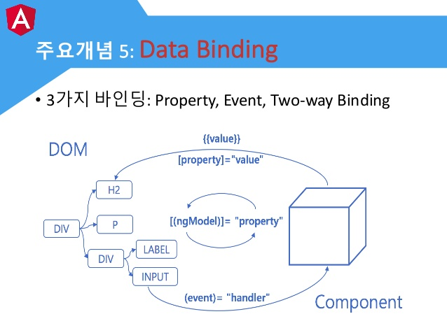

# 뷰를 구성하는 기초
- 앵귤러는 컴포넌트 단위로 뷰를 생성하고 관리
- 컴포넌트에는 뷰를 렌더링할 정보인 템플릿이 존재
- 템플릿은 HTML 요소와 앵귤러 문법을 통해 뷰를 렌더링할 정보와 이벤트 처리 로직을 갖고있다.
- 각 컴포넌트간에 공통으로 사용되는 정보나 로직은 서비스로 분리하여 로직을 처리한다.

## Component
- 컴포넌트는 하나의 클래스이다.
```
export class SimpleComponent{ }
```
위의 클래스는 아직 컴포넌트가 아닌 순수한 타입스크립트 클래스이다. 

@Component 데코레이터를 통해서 앵귤러가 위 클래스를 컴포넌트로 인지하게 해야한다.

@Component 데코레이터를 사용하기 위해서는 코어 패키지에서 Component 데코레이터를 임포트해야한다.

```
import { Component } from '@angular/core';

@Component({
    selector: 'af-simple',
    template: `<h1>Awesome</h1>`
})

export class SimpleComponent { }
```

## 메타데이터
- 위의 에제를 통해서 SimpleComponent클래스가 컴포넌트인 것을 명시했다.
- 추가적으로 Component 데코레이터를 통해 메타데이터를 받을 수 있다.
- 위 예제에서 @Component 데코레이터 안에 json객체로 메타데이터를 전달할 수 있다.
- 메타데이터는 18가지가 있으며, 필수가 아닌 추가적인 정보이다.

### 템플릿 정보
- 컴포넌트는 반드시 뷰를 그릴 정보를 갖고있어야 한다.
- 그러므로 템플릿 정보가 필수이며, 누락시 콘솔창에 'No template specified for component'예외가 출력된다 (엥....위에선 필수 입력할 필요 없다고 했으면서..??)
- 템플릿 정보는 template/templateUrl 두 가지가 있으며, template에는 직접 인라인 코드로 뷰를 그리며, templateUrl은 뷰에 필요한 코드가 길 경우 html파일을 작성하여 상대경로를 넣어준다.

### selector
- selector는 템플릿 코드 안에서 컴포넌트를 사용할 때 요소명을 정의하기 위해 사용.
- 예를 들어 A 컴포넌트의 메타데이터에 selector: 'my-header'이라고 작성했다면, 다른 컴포넌트에서 A컴포넌트 템플릿을 부를 경우 ``` <my-header></my-header> `` 와 같이 요소로서 사용 가능하다.

### 기타정보
- 해당 템플릿 코드에 스타일을 주기 위해 styles, stylesUrl을 통해 가능하다.

## 부트스트래핑
- 컴포넌트를 앵귤러가 다루는 시점은 애플리케이션을 부트스트래핑할 때이다.
- 부트스트래핑은 브라우저에서 애플리케이션을 최초 실행할 때 진행되는 과정을 말한다.

```
//AppModule.ts

@NgModule({
    declarations: [
        ...
    ],
    imports: [
        ...
    ],
    bootstrap: [AppComponent]
})
export class AppModule
```
- bootstrap은 애플리케이션이 부트스트래핑할 때 어떤 컴포넌트를 사용할 것인지 배열로 선언한 컴포넌트 정보이다.
- declarations에는 애플리케이션에서 사용될 모든 컴포넌트를 배열로 선언한다.
- 앵귤러 CLI를 통해 컴포넌트를 생성하면 자동으로 추가된다. 
- 수동으로 컴포넌트를 생성하면 직접 추가해줘야 사용가능하다.
- 이렇게 NgModule의 declarations, bootstrap에 컴포넌트를 반드시 등록하는 이유는, 이를 통해 앵귤러가 앵귤르 프레임워크에 작성한 코드를 해석해서 자바스크립트 코드로 변환하기 때문이다.

# Template
- 컴포넌트의 뷰를 구성하는 정보( HTML, 앵귤러 문법으로 작성 )
- 컴포넌트는 템플릿을 기반으로 뷰에 데이터를 전달.
- 컴포넌트는 템플릿을 기반으로 사용자의 이벤트에 로직을 수행.
- 컴포넌트와 뷰 사이의 상호작용은 템플릿에 작성한 '바인딩'으로 이루어진다.

## 데이터 바인딩

- 이미지 ref : [앵귤러 첫걸음(Angular for beginers), Hanbit Media | 한빛미디어](https://www.slideshare.net/mediahanbit/angular-for-beginers)


# directive
- 컴포넌트는 사실 directive이다.
- Component 데코레이터를 CMD+클릭 하여 보면 아래와 같이 Component는 Directive를 상속받는 인터페이스이다.
```
export interface Component extends Directive
```
- Component는 뷰를 구성할 정보를 갖고, 실제 뷰를 렌더링할 템플렛 정보를 포함한 특별한 Directive이다.
- Component는 다른 컴포넌트를 자식으로 가질 수 있으나, Directive는 뷰가 없기 때문에 컴포넌트를 자식으로 가질 수 없다.
- 즉, Directive는 Component와 다르게 뷰가 없지만, DOM을 관리하는 요소이다. 
- Component + View = Directive

## Structure Directive
- ngIf
```
<div *ngIf="isShow; else hiding"> Show </div>
<ng-template #hiding>
    <div> Hidden Div </div>
</ng-template>
```
- isShow가 true일 경우 상단에 있는 div가 보이고, false일 경우 하단의 div가 보인다.
- 여기에서 보인다는 의미는, DOM tree에 삽입이 된다는 뜻이며, 모든 div가 삽입 된 후 show/hide를 시키는게 아니라, 애초에 하나의 div만 DOM에 삽입되어 보인다.

- ngFor
```
// animals=['dog','cat','monkey','cow'];
<ul>
    <li *ngFor="let animal of animals; let idx = index">{{idx+1}} {{animal}}</li>
</ul>
```

- ngSwitch
```
<span [ngSwitch] = "animal">
    <span *ngSwitchCase="'dog'">멍멍</span>
    <span *ngSwitchCase="'cat'">뮤</span>
    <span *ngSwitchCase="'monkey'">끼룩</span>
    <span *ngSwitchDefault>힝구</span>
</span>
```
- ngContainer
    - 위의 예제들과 같이 DOM트리를 동적으로 사용하다보면 불필요한 Dummy HTML Element를 사용하게 된다.
    - ng-container태그를 사용하면 앵귤러가 DOM 트리에 포함시키지 않고 그 안의 내용만 뷰에 포함시킨다.
```
<span [ngSwitch] = "animal">
    <ng-container *ngSwitchCase="'dog'">멍멍</ng-container>
    <ng-container *ngSwitchCase="'cat'">뮤</ng-container>
    <ng-container *ngSwitchCase="'monkey'">끼룩</ng-container>
    <ng-container *ngSwitchDefault>힝구</ng-container>
</span>
```
## Attribute Directive
- 속성 지시자는 DOM의 모습이나 동작을 조작하는 데 사용
```
<div [class.show]="isVisible"> 헬로우 </div>
// isVisible 멤버변수가 true일 경우 위 div에 show라는 클래스를 추가하고, 그렇지 않은 경우 아무런 클래스를 추가하지 않는다.
```
```
<div [ngClass]="classObj"> 헬로우 </div>
// classObj = {'test-class':true, 'your-class':0,test:true }
// classObj객체의 각 키 값이 참인 경우에만 클래스 속성에 반영된다. 그러므로 최종 클래스는 다음과 같다.
// <div class="test-class test"> 헬로우 </div>
```

# Pipe
- 파이프는 뷰에 노출될 데이터를 변환 및 가공할 때 사용
- 앵귤러에서 제공하는 파이프는 DatePipe, UpperCasePipe, LowerCasePipe,  CurrencyPipe, PercentPipe 등이 있다
```
<p name="member-name"> {{ myName | uppercase }} </p>
//myName에 있는 문자가 모두 uppercase로 나온다
```

- Custom Pipe
```
//HonorPipe
import { Pipe, PipeTransform } from '@angular/core';

@pipe({ name: 'honor' })
export class HonorPipe implements PipeTransform {
    transform(value: string): string {
        return `${value}님`;
    }
}

<p name="member-name"> {{ myName | uppercase | honor }} </p>
//myName에 있는 문자가 모두 'uppercase'님 으로 나온다
```

```
//GeekMarkerPipe
import { Pipe, PipeTransform } from '@angular/core';

@pipe({ name: 'honor' })
export class GeekMarkerPipe implements PipeTransform {
    transform(value: string, level: string): string {
        switch (level) {
            case 'A':
                return `Oh Geek! ${value}`;
            case 'I':
                return `Good Man! ${value}`;
            case 'B':
            default :
                return `힝구! ${value}`;
        }
    }
}

<p name="member-name"> {{ myName | uppercase | honor }} </p>
<p name="member-name"> {{ myName | uppercase | honor | geekMark }} </p>
<p name="member-name"> {{ myName | uppercase | honor | geekMark:'A' }} </p>

```


Referencing

조우진 (2017), Angular 첫 걸음, 한빛미디어, 서울

